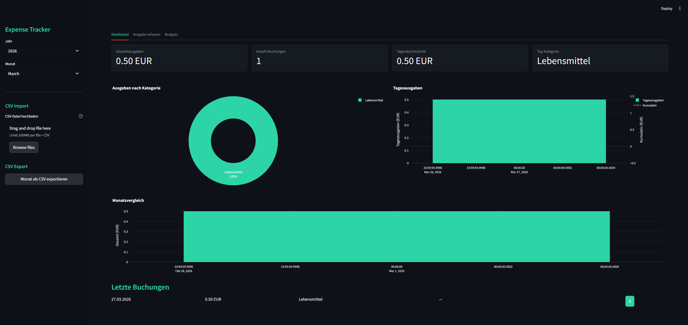

# Expense Tracker

[](LICENSE)
[](https://python.org)
[](https://streamlit.io)

A personal expense tracker with interactive charts, budget management, and CSV import/export. All data is stored locally in SQLite — no cloud, no account needed.



## Features

- **Expense Logging** — Add expenses with amount, category, date, and description
- **Dashboard** — Monthly overview with key metrics and interactive charts
- **Category Breakdown** — Donut chart showing where your money goes
- **Daily Trend** — Bar chart with cumulative spending line
- **Budget Limits** — Set monthly limits per category with visual progress bars
- **Monthly Comparison** — Compare spending across months
- **CSV Import** — Import bank statements or existing data
- **CSV Export** — Download your data for external analysis
- **Local Storage** — SQLite database, your data stays on your machine

## Tech Stack

| Technology | Purpose |
|---|---|
| Python 3.11+ | Core language |
| Streamlit | Web frontend & UI |
| Plotly | Interactive charts |
| pandas | Data processing |
| SQLite | Local database (built-in) |

## Installation & Setup

```bash
# Clone the repository
git clone https://github.com/FabioKurth/expense-tracker.git
cd expense-tracker

# Create virtual environment
python -m venv venv
source venv/bin/activate  # Linux/Mac
venv\Scripts\activate     # Windows

# Install dependencies
pip install -r requirements.txt

# Run the app
streamlit run app.py
```

The app will open in your browser at `http://localhost:8501`.

## CSV Import Format

To import existing data, prepare a CSV file with these columns:

```csv
date,amount,category,description
2026-03-01,45.50,Lebensmittel,Wocheneinkauf REWE
2026-03-02,9.99,Abonnements,Netflix
2026-03-03,35.00,Transport,Tanken
```

Required columns: `date`, `amount`, `category`. Optional: `description`.

## Project Structure

```
expense-tracker/
├── app.py                 # Main app / Streamlit entry point
├── components/
│   ├── __init__.py
│   └── charts.py          # Chart creation (Plotly)
├── utils/
│   ├── __init__.py
│   ├── database.py        # SQLite database layer
│   ├── expenses.py        # Business logic (CRUD, aggregations)
│   └── csv_handler.py     # CSV import & export
├── requirements.txt
├── .gitignore
├── LICENSE
└── README.md
```

## What I Learned

- **SQLite with Python** — Schema design, CRUD operations, and aggregation queries
- **Context managers** — Clean database connection handling with automatic rollback
- **Data aggregation with pandas** — Grouping, summarizing, and transforming financial data
- **Plotly chart customization** — Donut charts, dual-axis charts, and consistent theming
- **Streamlit forms & tabs** — Multi-page layout with form validation and session state
- **CSV handling** — Robust import with error handling and data validation

## License

This project is licensed under the MIT License — see the [LICENSE](LICENSE) file for details.
